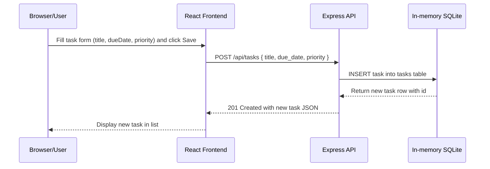

# Cloud Architecture Overview

A simple system-context diagram for the monorepo: React frontend, Express API, and in-memory store. Useful for onboarding and quick architecture reference.

```mermaid
graph LR
  Browser[User Browser\nReact Frontend\n(packages/frontend)]
  API[Express API\n(packages/backend) - port 3030]
  Store[In-memory Store\n(SQLite ':memory:' )]

  Browser -->|HTTP (proxy -> localhost:3030)| API
  API -->|SQL read/write| Store
```

## Sequence: Create a TODO

The following sequence diagram shows the client-server interaction when a user creates a new TODO item.



Notes:
- Frontend runs in packages/frontend and proxies API calls to http://localhost:3030.
- Backend runs in packages/backend and currently uses an in-memory SQLite instance for task storage.
